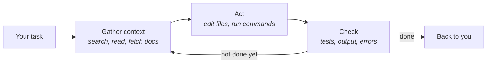

# The agentic loop

Drop a skilled developer into an unfamiliar codebase and watch them work. They read first.
They search around and run the tests to see what passes. Then they make a small change,
run the tests again, and adjust. An agentic coding tool works the same way. It runs the cycle
a careful professional has always run, hundreds of times faster, and it never gets tired.

**In this module:**

- What makes an agentic tool different from a chatbot
- The loop it runs: context, action, verification
- What the loop makes it good and bad at
- Why you are part of the loop
- The harness around the model, and why it is the half you own

## Chatbots and agentic tools

**A chatbot answers. An agentic tool does the work.**

- A chatbot takes your question and gives you an answer. You apply that answer yourself.
  Every step passes through your hands.
- An agentic tool takes a task. It opens files, runs commands, and edits code. It keeps
  going until the task is done, or until it needs something from you.
- The difference is not a smarter model. It is **tools** plus a loop. The tools let it
  search your code, read documentation, run commands, and edit files. The loop decides what
  to do next.

In plain terms: a chatbot is a consultant who gives you advice. An agentic tool is the
consultant sitting at your keyboard.

## The model and the harness

**Two things do the work, and only one of them gets talked about.**

- The **model** is the part that reasons. Opus, Sonnet, whichever you picked.
- The **harness** is everything around it: the tools it can reach, what gets read in and in what
  order, how many turns it may take, what happens when a check fails, when it stops to ask you.
  Claude Code is a harness. So is the setup in this repo.

Almost every conversation about better results is about the model - a newer one, a bigger one. But
the same model in a better harness is a different worker. NVIDIA took Claude Opus 5 from solving
about 30% of a long-horizon benchmark to solving all of it without touching the model, by rebuilding
what surrounded it: persistent memory, its own supervision, and observations in a format it could
actually use.

You cannot make the model smarter. The harness is the half you own, and it is where the gains are.

## The loop: context, action, verification

**Every task runs through the same three steps, over and over.**

- **Context.** The agent builds a picture before it works. It searches the codebase, reads
  your files and instructions, pulls up documentation, and runs a command to see what
  happens. It knows only what it has read.
- **Action.** It edits files, runs commands, and installs what is missing. Every action
  gives it a result it can read.
- **Verification.** It checks what happened. It runs the tests, then reads the output and any
  errors. Then it makes one decision: run the loop again, or hand the task back to you.

In plain terms: understand first, change second, check third. Good developers have always
worked this way. What changes is the speed - the cycle now takes seconds instead of hours.

## What the loop makes it good and bad at

**The loop is good at repetition and bad at judgment.**

| Good at | Bad at |
|---|---|
| Grinding through many steps without tiring | Knowing what it has not read |
| Sweeping wide - it reads more of a codebase in minutes than a person reads in a day | Judging its own work |
| Any task with a clear check: "make this test pass" | Knowing what you *meant* when your words say something else |

In plain terms: this split is old. Traditional development already separates the mechanical
work from the judgment. Writing, running and re-running code is mechanical. Deciding what to
build, and whether it is right, is judgment. The agent takes over the mechanical work. The
judgment stays with you.

## You are part of the loop

**The agent runs the loop. You steer it.**

- You supply the task and what "done" means. The agent cannot guess your intent.
- You supply the context it cannot find on its own: the reasons, the constraints, and what
  the customer said.
- You supply judgment. The agent cannot tell you whether the task is the right task.
- Steer early. A correction during the work costs seconds. A rework after the agent finishes
  costs the whole task.

In plain terms: you work like a team lead. The lead sets direction, shares what they know,
and judges the result.

## What you can do

- **Watch one full loop before anything else.** Give the agent a small real task and observe
  it: what it reads, what it runs, what it checks. Ten minutes is enough.
- **Say what done looks like** when you hand over a task. One sentence changes what the
  agent aims at.
- **Give the agent something to check against**: a test, an example of the expected output,
  or a way to run the thing. The check step is only as good as what you supply.
- **Interrupt early.** Speak up as soon as the agent heads the wrong way.
- **Write repeated explanations down.** The second time you explain the same thing, put it in
  the files the agent reads. This is how the agent learns your project.

## What to remember

- An agentic tool reads, acts and checks, in a loop, until the task is done.
- The loop is how careful developers have always worked: understand, change, check. It now
  runs in seconds, without tiring.
- The agent knows only what it has read.
- The agent's own checks answer "does it work". Whether the work is what you meant stays
  with you.
- You are part of the loop. You supply the task, the missing context, the judgment and the
  steering.
