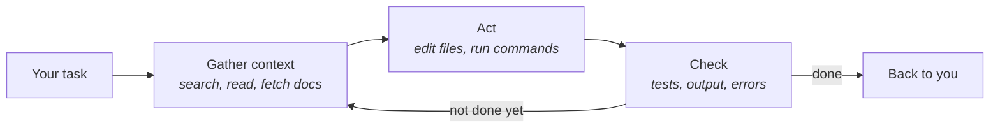

# The agentic loop

Drop a skilled developer into an unfamiliar codebase and watch what they do. They don't
start typing. They read, search around, run the tests to see what's green. Then they make a
small change, run things again, adjust. An agentic coding tool works exactly this way - the
same cycle a careful professional has always run, now automated, hundreds of times faster,
and never tired.

**In this module:**

- What makes an agentic tool different from a chatbot
- The loop it runs: context, action, verification
- What the loop makes it good and bad at
- Why you are part of the loop

## From answering to doing

**A chatbot answers. An agentic tool does.**

- With a chatbot, you paste something in, get an answer back, and apply it yourself. Every
  step passes through your hands - the machine advises, you do the work.
- An agentic tool takes a task: it opens files, runs commands, edits code, and keeps going
  until the task is done - or until it needs something from you.
- The difference is not a smarter model. It's **tools** - the ability to search and read
  your code, fetch documentation, run commands, edit files - plus a loop that decides what
  to do next.

In plain terms: chat is asking a consultant for advice. Agentic is the consultant sitting
down at the keyboard.

## The loop: context, action, verification

Everything the tool does is one loop, run over and over.

- **Context.** It uses its tools to build a picture before it works: searching the
  codebase, reading your files and instructions, pulling up documentation, running a
  command just to see what happens. This is all it has - what it hasn't seen doesn't exist
  for it.
- **Action.** It edits files, runs commands, installs what's missing. Every action produces
  a result it can look at.
- **Verification.** It checks what happened - runs the tests, reads the error, looks at the
  output - and decides: loop again, or hand back.

If this sounds familiar, it should. Understand first, change second, test third is how
software has always been built well. The upgrade is that the cycle now runs in seconds
instead of hours - and doesn't lose patience on the fortieth repetition.

## What the loop makes it good and bad at

| Good at | Bad at |
|---|---|
| Grinding through many steps without tiring | Knowing what it hasn't read - context is everything it has |
| Sweeping wide - reading more of a codebase in minutes than a person does in a day | Judging its own work - it grades its own homework |
| Anything with a clear check: "make this test pass" | Knowing what you *meant* rather than what you wrote |

Traditional development always had the same split: the mechanical parts - writing, running,
re-running - and the judgment parts - what to build, whether it's right. The loop takes over
the first set. The second set doesn't move; it stays with people.

## You are part of the loop

**The agent runs the loop. You steer it.**

Think of it the way a team lead works: the lead doesn't type every line either - they set
direction, share what they know, and judge the result.

- You supply the task, and what "done" means - the loop can't guess intent.
- You supply the context it can't find on its own: the reasons, the constraints, what the
  customer actually said.
- You supply judgment: left alone, the loop will happily finish the wrong thing well.
- Steer early. A word while it works costs seconds; a rework after it finishes costs the
  whole task.

## What you can do

- **Watch one full loop before anything else.** Give a small real task and just observe:
  what it reads, what it runs, what it checks. Ten minutes, and the mental model sticks.
- **Say what done looks like** when you hand over a task - even one sentence changes what
  the loop aims at.
- **Give it something to check against**: a test, an example of the expected output, a way
  to run the thing. The check phase is only as good as what you gave it.
- **Interrupt early.** If it's heading somewhere wrong, say so now - don't wait politely
  for it to finish being wrong.
- **Write repeated explanations down.** The second time you explain the same thing, put it
  where the agent reads (its instruction files) - that's how the loop learns your project.

## What to remember

- An agentic tool doesn't just answer - it reads, acts, and checks, in a loop, until done.
- The loop is how careful developers always worked - understand, change, check - now
  running in seconds, without tiring.
- It only knows what's in front of it. Context is everything it has.
- Its own checking answers "does it work" - "is it what you meant" stays yours.
- You are part of the loop: the task, the missing context, the judgment, the steering.
