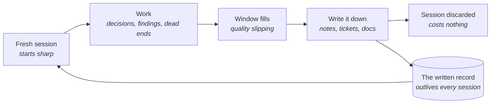

# The context window

An agent works from a single whiteboard. Everything it has read, written, tried and abandoned
in a session stays up there - the brief, the files it opened, the approach that didn't work.
Nothing gets erased, and long before the board runs out of room it gets hard to read. That
board is the context window, and most of the skill is deciding what stays on it.

**In this module:**

- What the context window is, and what spends it
- Why quality falls long before the window is full
- Where thresholds like "wrap up at 40%" actually come from
- How to throw a session away without losing what it learned

## Everything in the session is on the board

**The context window is a budget of text, and every part of the session spends it.**

- What goes in: your instructions, the task, the files it read, the docs it fetched, the tools
  you connected, the output of every command, and every word it wrote back.
- Nothing falls off the end. A log printed an hour ago is still there, taking up room and
  competing for attention.
- Tool output is usually the surprise - one log dump can fill more of the window than the whole
  conversation.

In plain terms: it isn't "what the agent remembers", it's what still fits on the board.
Software has always had a version of this limit - only so much of a system fits in one person's
head - which is why work gets cut into pieces small enough to hold.

## Quality falls before the board is full

**It's tempting to treat the window like a fuel tank: fine until empty. It isn't.**

Work gets worse as the window fills, and the decline starts well before any warning appears.
This has been measured across many models, on tasks simple enough that there was no excuse for
getting them wrong. The symptoms are familiar: a constraint quietly dropped, the same question
asked twice, finished work redone.

- Half-relevant leftovers do the most damage. Unrelated material is easy to ignore; material
  that is *nearly* right is not - the abandoned approach, the older version of the function.
  Those get pulled back in, and this has been measured too.
- The decline isn't uniform. Mechanical repetition holds up far better than a session full of
  decisions and reversals, and short tasks never get near any of this.

## Watch the gauge, not the ceiling

**You can't pace a budget you can't see.**

So stop guessing. Agent tools can report how much of the window a session has spent; put that
number where you see it without asking - the status line is the usual home, and it's a one-off
setup. Show two things: **how full, in plain numbers** (60k used of 200k), and **which zone
that lands in, with a name on it**. The question stops being "am I out of context?" and becomes
"which zone am I in, and is this the work to be doing in it?"

| Window used | What you'll notice | Still good for | The move |
|---|---|---|---|
| Under 40% | Sharp - holds the whole task, still obeys the instructions from the top | Design, decisions, anything new | Do the thinking here |
| 40-60% | Small slips: a dropped constraint, a question asked twice | Finishing what's underway | Start nothing new |
| 60-80% | Drift: two tasks bleeding together, finished work redone | Mechanical follow-through | Write the notes now |
| Over 80% | The tool compresses its own history to make room | Very little | Hand over, start fresh |

We break the zones at 40, 60 and 80, and tell people to start wrapping up around 40%. The
honest part: **nobody measured that number.** In the field you'll also hear 60, or raw amounts
like "I stop at 100k" - none of them measured either. The idea underneath is solid; the digit
is folklore, and we keep ours because a shared habit beats everyone improvising. Treat any
threshold, ours included, as a default rather than a law: if your work degrades earlier, wrap
up earlier.

## A session is throwaway - what it learned is not

**People keep sessions alive too long for one honest reason: the session knows things.**

Why that approach failed, what the client said on the call, which corner of the code is
fragile. Ending it feels like losing all of that, so tired sessions get pushed further instead
of replaced. The fix isn't longer sessions - it's making the knowledge outlive them: notes in
the repo, the decision in the ticket, a handover for tomorrow. Then ending one costs nothing.

None of this is new. Every profession that works in shifts writes the log whether or not anyone
feels like it, and software has kept commit messages and decision records for the same reason:
the conversation is temporary, the record is not.

Most of that record already exists without anyone maintaining it: the issue says what was
being built, the commits say what changed. `handoff` covers what they miss - the decisions
settled out loud that were never written anywhere. Good test: could a colleague pick your
project up from the files alone right now?

## What you can do

- **Put the gauge on screen.** Percentage, raw numbers, named zones - so the session's state is
  a glance, not a discovery.
- **One task, one session - and big jobs in phases.** Carrying task A's leftovers into task B is
  how sessions get confused, and each phase deserves a fresh head.
- **Don't push through the dim patch.** When a session forgets, repeats or drifts, wrap up - in
  our experience ten minutes of handover beats an hour of degraded work.
- **Cut what feeds the window.** Don't connect tools you won't use today; don't paste a whole
  file when the part that matters would do; let a separate agent do the wide reading, so it
  hands back an answer instead of everything it read.
- **Write down the part that exists only in the chat** (`handoff`). A decision nobody recorded
  dies with the session that made it.

## What to remember

- The context window is a budget of text and everything spends it - files, tool output, dead
  ends. Nothing falls off the end.
- Quality falls long before the window is full, and half-relevant leftovers do the most damage.
- Make it visible: a gauge turns "am I out of context?" into "which zone am I in?"
- Thresholds like our 40% are shared habits, not laws. Your own observation beats our number.
- A session is throwaway; what it learned is not. Write it down and restarting costs nothing.
