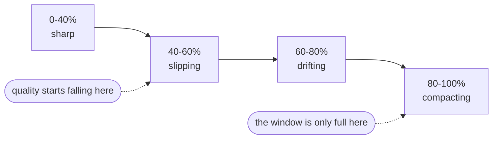
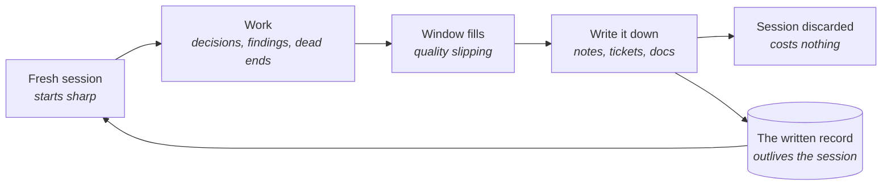

# The context window

An agent works from a single whiteboard. Everything it has read, written and tried stays up
there - the brief, the files it opened, the approach that failed. Nothing gets erased, and the
board gets hard to read long before it fills. That board is the context window, and most of the
skill is deciding what stays on it.

**In this module:**

- What the context window is, and what spends it
- Why quality falls before the window is full
- Where thresholds like "wrap up at 40%" come from
- How to discard a session and keep what it learned

## Everything in the session is on the board

**The context window is a budget of text, and every part of the session spends it.**

- What goes in: your instructions, the task, the files it read, the docs it fetched, the tools
  you connected, every command's output, and every word it wrote back.
- Nothing falls off the end. A log printed an hour ago still takes up room and competes for
  attention.
- Tool output is usually the surprise: one log dump can fill more of the window than the whole
  conversation.

In plain terms: the window holds what still fits on the board. Software has this limit already -
only so much of a system fits in one head, so teams cut work into small pieces.

## Quality falls before the board is full

**It's tempting to read the window like a fuel tank: fine until empty. It isn't.**

Work gets worse as the window fills, and the decline starts before any warning appears. This has
been measured across many models, on tasks simple enough to leave no excuse. The symptoms are
familiar: a dropped constraint, the same question asked twice.

- Half-relevant leftovers do the most damage. The agent ignores unrelated material, but it pulls
  back material that is *nearly* right - the abandoned approach, the older version of the
  function. This has been measured too.
- Mechanical repetition holds up better than a session full of decisions and reversals. Short
  tasks stay well below these levels.

## Make the spend visible

**You can't pace a budget you can't see.**

Agent tools can report how much of the window a session has spent. Put that number where you
see it without asking - the status line is the usual home, and it's a one-off setup. Show the
raw numbers (60k of 200k) and the name of the zone.

| Window used | What you'll notice | Still good for | The move |
|---|---|---|---|
| Under 40% | Sharp. Holds the whole task and obeys the instructions from the top | Design, decisions, anything new | Do the thinking here |
| 40-60% | Small slips: a dropped constraint, a question asked twice | Finishing what's underway | Start nothing new |
| 60-80% | Drift: two tasks mix together, finished work gets redone | Mechanical follow-through | Write the notes now |
| Over 80% | The tool compresses its own history to make room | Very little | Hand over and start fresh |

We break the zones at 40, 60 and 80, and advise wrapping up around 40%. The honest part:
**nobody measured that number.** You'll also hear 60 in the field, or raw amounts like "I stop
at 100k", and nobody measured those either. The idea is solid; the digit is folklore. We keep
ours because a shared habit beats each person improvising. Treat any threshold as a default,
ours included: wrap up earlier if your work degrades earlier.

## Keep the knowledge, discard the session

**People keep sessions alive too long for one honest reason: the session knows things.**

Why an approach failed, what the client said on the call, which corner of the code is fragile.
Ending it feels like losing all of that, so tired sessions get pushed further. The fix is to
make the knowledge outlive the session: notes in the repo, the decision in the ticket, a
handover for tomorrow.

Professions that work in shifts write the log anyway, and software keeps commit messages for the
same reason.

Most of that record already exists without anyone maintaining it: the issue says what was
built, the commits say what changed. `handoff` covers what they miss - the decisions settled
out loud and never written down. Good test: could a colleague pick your project up from the
files alone?

## What you can do

- **Put the gauge on screen.** Then you read the session's state at a glance.
- **One task, one session - and big jobs in phases.** Task A's leftovers confuse task B, and
  each phase deserves a fresh head.
- **Stop when the session dims.** When it forgets, repeats or drifts, wrap up. In our
  experience ten minutes of handover beats an hour of degraded work.
- **Cut what feeds the window.** Don't connect tools you won't use today. Don't paste a whole
  file when the part that matters would do. Let a separate agent do the wide reading.
- **Write down the part that lives only in the chat** (`handoff`).

## What to remember

- The context window is a budget of text and everything spends it - files, tool output, dead
  ends.
- Quality falls before the window is full, and half-relevant leftovers do the most damage.
- Make it visible. A gauge turns "am I out of context?" into "which zone am I in?"
- Our 40% is a shared habit that nobody measured. Your own observation beats it.
- A session is throwaway. Write down what it learned, and starting a new one costs nothing.
