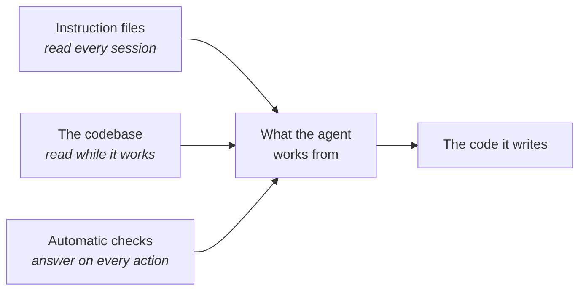

# What the agent reads

A senior developer joins on Monday. You hand them the onboarding page and they read it once. Two
other things shape their first pull request: the code they read on the way there, and the build
that rejects it at four o'clock. An agent learns from the same three sources, in the same order of
importance. It starts from nothing each session, so those three are all it has.

**In this module:**

- What decides the result: the material and the tools you hand over
- The three surfaces it reads: your instruction file, your code, your checks
- Why a check beats a written rule for the expensive mistakes
- How to tell which of your rules have quietly expired

## Equipping the agent

**Clever wording was a workaround for weak models. What you hand the agent decides the result
now.**

Prompt engineering mattered when models were weak enough that the wrapper carried the answer. That
advice has expired. Today's models are good enough that how you phrase the request barely moves the
result. Two things move it: how much relevant material you put in front of the agent, and how much
it can reach on its own.

Give the agent a way to run the app or query the database, and it checks its answer. Take that
access away and the same model guesses, in the same confident voice. Fit matters more than quantity:
every tool takes room in the context window, used or not. Prefer the tools that show the agent the
real system.

In plain terms: better material moves the result. Better wording does not.

## Three surfaces the agent reads

**Three things shape what the agent writes: its instruction files, your codebase, and your
automatic checks.**

**Instruction files** are the standing brief. In Claude Code that is `CLAUDE.md`, read at the start
of every session. A good line pays back every day. A stale line costs every day, and nothing errors
when it goes stale.

This has been measured: a repository instructions file did not generally improve task success, and
it added over 20% to the cost of every run. The agent followed the instructions well. The folder
*tour* was the wasted part, because the agent can see the layout by looking.

So keep what stays true and what the code does not show: the non-standard convention, the reason
behind an odd-looking decision. In our experience one screen is a good target, re-read monthly. And
do not let a generator write it. A generator produces exactly the tour the measurement found
unhelpful, and you pay for it on every run afterwards. Start nearly empty. Grow the file from real
corrections: the times the agent got something wrong that one sentence would have prevented.

**When you re-read it, most of what you cut will be a rule that expired.** For years the rule was:
change your password every 90 days. It made sense once. Then it started backfiring, because people
just added a digit. The standards bodies dropped the advice. Plenty of companies still enforce it.

AI rules age the same way, and faster. Almost every one exists because a model could not be trusted
with something, and models change every few months. A stale rule does not look stale. It looks like
discipline, and you pay for it on every task.

One question sorts them: **what would have to be true for this rule to be pointless?** If you can
answer that, go and look, because it may already have happened. If you cannot answer it, the rule
was probably never doing anything. Two guards keep this honest. Split the rule before you judge it,
because the claim behind it usually outlives the specific wording it was written as. And never run
the question over secrets, production data or anything sent outward: judge those by the worst case,
because a better model does not shrink a worst case.

## The codebase is the loudest of the three

**The twenty files around the edit set the pattern. You get a twenty-first that does the same.**

You can write "always handle errors properly" in the instruction file. If the surrounding code
swallows errors, you get one more file that swallows errors. The agent reads far more code than
instructions, and the code shows how the work is done here. Names and folder structure count too:
the same filename in `tests/` and in `src/core/` means two different things.

[`improve-codebase-architecture`](../skills/improve-codebase-architecture/SKILL.md) works on this
surface directly: it reads the codebase for the patterns the agent will copy, and proposes the ones
worth deepening.

So the old disciplines are worth more now. Clear boundaries, small pieces with obvious jobs, one
consistent way of working, runnable tests: each is also a message the agent copies forward. In a
messy area it re-reads more and burns more of its window. Mess taxes every task. When output drops
off in one corner of the repo, look at that code first.

## A written rule and an automatic check

**A written rule lowers the odds of a mistake. An automatic check removes them.**

"Never run the command that erases shared history." "Always run the formatter." Written like that,
both rules are wishes. The agent can miss a rule, misread it, or lose it when a long session gets
summarised. An automatic check is a small program, called a hook, that runs on every action, blocks
the bad ones and tells the agent why. The linter is its ancestor.

|  | A written rule | An automatic check |
|---|---|---|
| Where it lives | your instruction file | a program that runs on every action |
| How well it holds | usually | always |
| How it fails | quietly, you find out later | loudly, with a reason |
| Fits | judgment calls: keep functions small | clear yes/no calls: dangerous commands, secrets |
| Costs | a line of the window, every session | a few lines of code, once |

Sort your rules by the cost of breaking each one. Write a check for the expensive ones: lost data,
a leaked password, a change to the live system. A check that fixes beats one that forbids: an
after-edit formatter enforces itself. Each rule a check enforces is a line the instruction file no
longer needs.

## What you can do

- **Hand over the material before you polish the sentence.** The relevant file, the real error, the
  actual ticket beat any wording.
- **Read your instruction file top to bottom this week.** Cut what the code shows and what stopped
  being true.
- **Fix the pattern before you scale the work.** Clean the area first if many tasks will run
  through it ([`review-suite`](../skills/review-suite/SKILL.md), `/code-review low`).
- **Turn your two or three most expensive rules into checks.** The rest stays prose.
- **Give the agent a way to check its own work**: tests, a way to run the app, read access to the
  data ([`tdd`](../skills/tdd/SKILL.md), [`verify-feature`](../skills/verify-feature/SKILL.md)).
- **Write the reasons down when you catch yourself repeating them** ([`grill-me`](../skills/grill-me/SKILL.md), [`to-spec`](../skills/to-spec/SKILL.md)).
  Repeated explanation belongs on one of the three surfaces.

## What to remember

- Clever phrasing was a workaround for weak models. Results now come from the information and
  tools you supply.
- Three surfaces shape the output: the instruction files, the codebase, the automatic checks.
- Keep in the instruction file what stays true and what the code cannot show. Cut the repo tour;
  that part has been measured.
- The codebase teaches louder than the instruction file. Mess taxes every task.
- A written rule lowers the odds. An automatic check removes them. Sort by the cost of breaking
  each rule.
