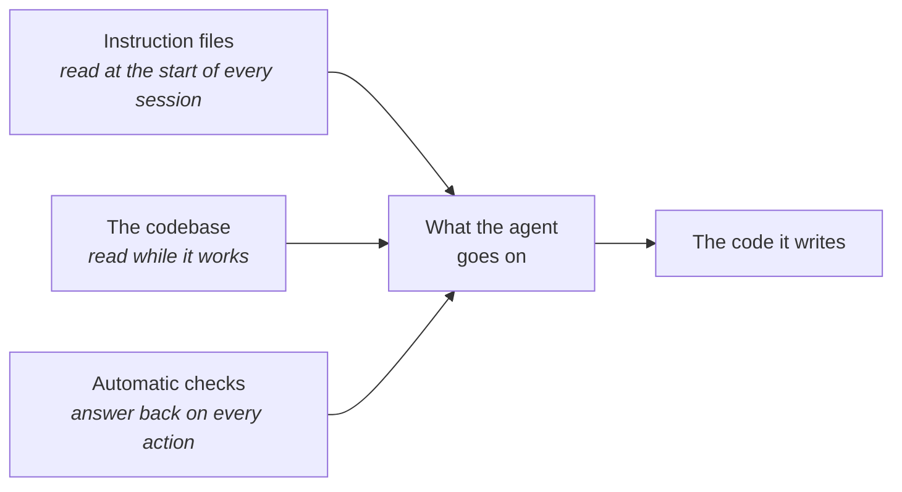

# What the agent reads

A senior developer joins on Monday. You hand them the onboarding page and they read it once -
but what shapes their first pull request is the code they read on the way there, and the build
that rejects it at four o'clock. An agent learns the same three ways, in the same order of
importance. It just starts from nothing every session, so those three are all it has.

**In this module:**

- Why equipping the agent beats wording the request cleverly
- The three surfaces it reads: your instructions, your code, your automatic checks
- The difference between a written rule and a check it can't walk past

## Equipping the agent, not phrasing the request

**Clever wording was a workaround for weak models. That era is over.**

There was a real period when phrasing carried the result: the magic opening line, "think step
by step", the role-play preamble. Models were weak enough that the wrapper mattered; that advice
has expired. What replaced it is unglamorous. Results come from *equipping* the model - the most
relevant information you can put in front of it, and the best tools to go find the rest.

The tools half is easy to underrate. Give the agent a way to run the app, query the database or
fetch current documentation and it checks; without those, the same model guesses, in the same
confident voice. Fit matters more than quantity - every tool takes room in the window whether it
gets used or not, and the ones that let it see the real thing beat the ones that describe it
secondhand. Which tools are worth having changes every few months; that this is where the
leverage sits doesn't.

In plain terms: stop writing better briefs, start handing over better material. Which makes the
real question what's within reach.

## Three surfaces the agent reads

**Agent output is shaped by three things: its instruction files, your codebase, and your
automatic checks.**

**Instruction files** are the standing brief - in Claude Code that's `CLAUDE.md` - read at the
start of every session, forever. That makes them the most valuable text you own and the most
expensive place to be wrong: a good line pays every day, a stale line costs every day, and every
line takes room the agent needs for the task itself.

This has been measured, and the result is bracing: adding a repository instructions file did not
generally improve task success, while adding over 20% to the cost of every run. The useful
detail is the split. Instructions were followed well; repository *overviews* - the "what this
project does, here's the folder layout" section everyone writes first - didn't help, because the
agent can see all that by looking. So keep what's always true and undiscoverable: the
non-standard convention, the command that isn't the obvious one, the reason behind a decision
that looks wrong. Cut the tour. In our experience one screen is a good target, re-read monthly -
nothing errors when a line goes stale.

## The codebase is the loudest of the three

**Whatever the twenty files around the edit do, you get a twenty-first that does the same.**

You can write "always handle errors properly" in the instructions. If the surrounding code
swallows errors, you get one more file that swallows errors. The agent reads far more code than
instructions, and code is the ground truth of how things are done here - names and folder
structure included: the same filename in `tests/` and in `src/core/` means two different things
to it.

Which is why the old disciplines got *more* valuable, not optional. Clear boundaries, small
pieces with obvious jobs, one consistent way of doing things, runnable tests - each is now also
a message the agent copies forward, and every task multiplies whatever pattern it found. In a
messy area it also re-reads more and burns more of its window finding its way. Mess doesn't stop
it; it taxes every task. So when output drops off in one corner of the repo, look at that
corner's code before blaming the model.

Some rules, though, are too expensive to leave to imitation at all.

## A wish and a wall

**A written rule lowers the odds. A check that runs by itself removes them.**

"Never run the command that erases shared history." "Always run the formatter." Written like
that, these are wishes: they help, and that's all. The agent can miss one, misread it, or lose
it when a long session gets summarised and older instructions fall out. An automatic check is a
different animal - a small program (a hook) that runs on every action, blocks the bad ones and
tells the agent why. The ancestor is the linter, and the lesson is the one it taught: the style
guide nobody follows becomes the check nobody can skip.

|  | A written rule | An automatic check |
|---|---|---|
| Where it lives | your instruction files | a program that runs on every action |
| How well it holds | usually | always |
| How it fails | quietly - you find out later | loudly, in the moment, with a reason |
| Fits | judgment calls: keep functions small, prefer this pattern | clear yes/no: dangerous commands, secrets, production access |
| Costs | a line of the window, every session | a few lines of code, once |

Sort your rules by what breaking one costs. Losing data, leaking a password, touching the live
system - build the wall. Better still is a check that *fixes* rather than forbids: an after-edit
formatter enforces itself, and every rule a check enforces is a line the standing brief no
longer needs.

## What you can do

- **Put the material in front of it before polishing the sentence.** The relevant file, the real
  error, the actual ticket - that moves the result far more than the wording.
- **Read your instruction file top to bottom this week.** Cut anything discoverable from the
  code and anything that stopped being true; keep the non-obvious - what nobody
  could work out from the code itself.
- **Fix the pattern before you scale the work.** About to run many tasks through one area? Clean
  it first - every task copies what it finds (`check-software-principles`, `review-suite`,
  `/code-review low`).
- **Turn your two or three most expensive rules into checks.** The ones where "usually" isn't
  good enough; everything else stays prose.
- **Give it a way to check its own work**: a test suite, a way to run the app, read access to
  the data (`tdd`, `verify-feature`) - worth more than another paragraph of instruction.
- **Write the reasons down when you catch yourself repeating them** (`grill-me`, `to-spec`).
  Repeated explanation means something belongs on one of the three surfaces.

## What to remember

- Clever phrasing was a workaround for weak models; what moves results now is equipping the
  model with information and tools.
- Three surfaces shape the output: the instruction files, the codebase, the automatic checks.
- Instruction files are read every session - keep what's always true and undiscoverable, and cut
  the repo tour; that part has been measured, and it doesn't help.
- The codebase teaches louder than the instructions: structure compounds, mess taxes every task.
- A written rule lowers the odds; a check that runs by itself removes them. Sort by what
  breaking it costs.
