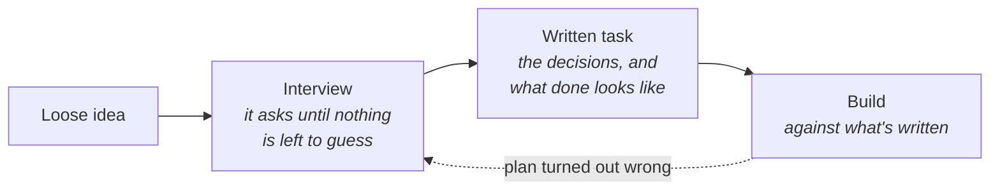

# Deciding before building

Nobody pours a foundation to find out where the kitchen goes. Drawings come first, the client
argues with them, and only then does anyone order concrete - because the expensive part of
building was never the bricklaying. It was discovering in week twelve that "open plan" meant
something different to each of you. Agents made the bricklaying cheap. They did nothing to that
discovery.

**In this module:**

- Why a vague brief gets a confident guess instead of a question
- What replaced prompting tricks: being on the same page before building
- What changing your mind costs, and when to go look instead of plan
- Keeping deciding and building apart

## A vague brief gets a confident guess

**When a person doesn't understand a task, they ask. An agent picks a reading and builds it.**

- Give it something vague and it silently picks one interpretation, then builds that one well -
  a finished, professional answer to a question you didn't ask.
- The danger isn't bad code. It's good code for the wrong thing, which sails through review.
- Watch for the words that mean it guessed: "I assumed...", "typically this would...". Each is
  a decision you left open and it quietly closed.
- Politeness isn't clarity. "Make it nice and clean" decides nothing. "Never more than three
  clicks to create an order" decides something.

In plain terms: the test for *done deciding* is whether someone with no access to your head
could build the right thing from what's written down.

## The thing that replaced the tricks

**Clever wording stopped mattering. Shared understanding never did.**

Getting good work out of a model used to be partly a craft of phrasing - assign it a role, tell
it to think step by step, find the magic words. Those were workarounds for models that filled
gaps badly, and they expired as the models got good. What's left was never a trick: you and the
agent wanting the same thing. The way there is the oldest one going - the requirements meeting,
where somebody asks questions until the vagueness is gone. What's new is who answers.

- **Let it interview you.** `grill-me` works through the open decisions one question at a time
  and proposes an answer to each, so you're mostly saying yes or no. A useful interviewer isn't
  agreeable - it raises angles you hadn't considered.
- **Then write it down.** `to-spec` turns the answers into a spec, `to-issues` cuts it into
  tasks. Written decisions travel: to tomorrow's session, to a colleague, to whoever checks the
  work.
- **Let the task carry "done".** What must be true at the end, and where it would realistically
  break - otherwise nobody can tell finished from abandoned.

## Changing your mind is cheap right up until it isn't

**A decision gets more expensive to change the further it has travelled.**

| Change your mind | What it costs | What you're editing |
|---|---|---|
| While deciding | Minutes | A sentence in a document |
| Mid-build | Hours, plus the work already done in the old direction | Code that exists |
| After shipping | Days, and rarely just code | Data, habits, everything built on top |

Agents bent only the middle of that curve. Writing code got dramatically cheaper; migrating
live data and unpicking the code that grew around the old shape did not. The curve also marks
the honest limit here - if a wrong guess costs two minutes, interviewing for ten is waste. For
throwaway work it's flat, and vagueness is fine.

## When you can't describe it, go look

**Some work can't be specified up front, because you don't know what you want until you've seen
something.**

Planning anyway doesn't remove the uncertainty - it hides it inside tickets that look precise
and aren't.

- If you can't answer "how should this feel?" in words, ask for something to click: one
  disposable file you open in a browser (`prototype`). The rough version is cheaper to build
  than to argue about.
- Questions of fact - what does that API actually return - get answered before planning, not
  guessed inside a ticket. A guess about a fact isn't a decision.
- When the work is too big to hold in your head, map the open decisions and settle them one at
  a time (`wayfinder`) rather than plan on top of unknowns.

Work you've done ten times before needs none of this.

## Decide, then build

**Deciding and building are different modes, and blending them ruins both.**

If the agent doing the work may also renegotiate what the work *is*, every surprise gives it
two bad options: quietly change the goal, or quietly work around it. Both happen out of sight,
mid-build. This has been measured - agents carry out a specified change reliably, and are much
weaker at choosing which change to make.

Keeping them apart is mostly a matter of shape. Our build flow is two steps on purpose: one
reads the ticket, checks its claims still hold against the live code and sets up the workspace
(`pickup-issue`); the other builds without reopening it (`implement`). Mid-build "wouldn't it
be better if..." goes into a comment for later - and when the plan really is wrong, change it
out loud rather than blurring the two.

## What you can do

- **Let it interview you before it builds anything.** Ten minutes of questions ahead of a day
  of work is a good trade (`grill-me`).
- **Write the decisions down where the work happens.** In the spec and the tickets, not in a
  chat you'll close (`to-spec`, `to-issues`).
- **Put "done" in the task.** A sentence or two on what must be true at the end changes what
  the agent aims at.
- **Go look when words run out.** A throwaway clickable version teaches you the requirements
  faster than another planning round (`prototype`).
- **Treat assumption words as a flag.** "I assumed" means a decision got made without you - go
  back and make it yourself.

## What to remember

- An agent doesn't ask when it's unsure. It guesses, then builds the guess well.
- Prompting tricks expired. Being on the same page before building didn't.
- The interview is the cheap part: questions until nothing's left to guess, then a written task
  that says what done looks like.
- Changing your mind costs minutes on paper, hours once code exists, days once it ships.
- If you can't describe it, don't plan it - build something rough and react to that.
