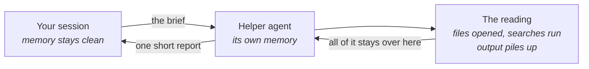

# Handing work off

A lead who sends a contractor to a site across town writes the brief carefully, because nobody
can shout a follow-up question across the city. Whatever the brief leaves out, the contractor
settles alone, and you find out when they come back. You can hand work to an agent the same
way. The helper agent works on its own and reports back to you.

**In this module:**

- Where the gain comes from
- What a brief must carry when nobody can ask questions
- Which work travels well, and which stays with you
- What running several helpers at once costs

## Where the gain comes from

**The helper works in its own memory. Only the answer comes back to yours.**

Handing a task to a helper agent looks like hiring temps: more agents, more output. That picture
leads to bad decisions, because the real gain is a quieter one. The helper can open thirty files
and read a wall of test output; what lands in your session is one paragraph.

- **Big in, small out is the shape that pays.** "Find every place we create a session token."
  "Read these three doc pages and answer one question." It reads a lot and returns a short
  answer.
- **You get the conclusion.** The helper reports where it got to, and the path it walked stays
  in its own session. If you need to watch the work as it happens, keep it with you.
- **The helper starts fresh.** It gets your project - the same files, the same instruction
  files, the same permissions. It does not get your conversation, so it does not know what you
  agreed ten minutes ago.

In plain terms: this is outsourcing a document review. You get the summary, and someone else
does the reading.

## The brief has to stand alone

**A helper agent cannot ask you what you meant.**

A colleague stops halfway and asks "do you mean A or B?". A helper agent does not ask, so it
fills every gap with a guess. The guess is invisible, and what comes back is a confident answer
to a question you did not quite ask. A brief that travels carries four things.

|  | Thin brief | Stands alone |
|---|---|---|
| The goal | "look into the auth code" | "list every place a session token gets created" |
| What comes back | unsaid, so you get an essay | "one line per hit: file and line number, nothing else" |
| Where to look | unsaid | "start in the auth service; the old billing path is out of scope" |
| The edges | unsaid | "read only - don't change any files" |

Traditional development already had this test: write the ticket well enough that nobody comes
back to ask.

## What travels, and what stays

**Send the work you can describe. Keep the work you are still working out.**

How well you can describe the task decides most of the handoff.

- **Travels well:** searching, reading and gathering. Any work where you already know what a
  good answer looks like. Review passes travel well too.
- **Stays with you:** the design you have not settled, the bug you do not understand yet, and
  anything you want to steer as you learn. This work needs a conversation, and a helper agent
  cannot have one with you.
- **Not worth it either way:** small tasks. The briefing costs more than the task.

The fuzzy work is usually the deciding work. Settle it yourself, then hand off the rest once
the decision makes it describable.

## Several at once

**Parallel helpers suit independent questions.**

Three separate searches at once fits the shape. Three helpers on one fuzzy question runs the
same search three times, or returns three confident answers that disagree. Checking those costs
more than doing the work yourself. The division of labour goes in the briefs, because nobody at
the site can negotiate it.

Fanning out burns tokens fast. On research work, one agent has been measured at four times a
plain chat, and several agents at fifteen times. So the task has to be worth the spend. Every
helper also reports back into your session, so enough of them refill your memory.

## What you can do

- **Read the brief back before you send it.** If it says "figure out what makes sense", you're
  handing off a decision you haven't made. Keep that one.
- **Name the shape of the answer.** "A list of file paths, one per line, nothing else" beats
  "report your findings", and it makes a thin answer easy to spot.
- **Hand off the reading first**, the safest place to start. `research` sends a reading job
  offstage and brings back a findings file.
- **Write tickets that stand alone.** `to-issues` splits work into tickets that each carry
  their own context. `pickup-issue` loads one cold, and `implement` builds from it. A ticket
  that fails a cold pickup was thin. Run that test on purpose.
- **Fan out on independent questions.** One helper cannot see what another found.
- **Keep the deciding close.** On work too big to hold in one go, settle the open questions
  first, then hand off what that makes describable (`wayfinder`).

## What to remember

- A helper agent works in its own memory, and only the answer comes back to yours.
- Big in, small out is the shape that pays. Searching, reading and gathering fit it.
- A helper cannot ask a follow-up. The goal, the output, the place to look and the edges go in
  the brief.
- Send what you can describe. Keep what you are still working out.
- Several at once suits independent questions. Every report still comes home to your session.
