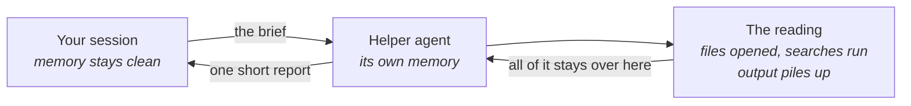

# Handing work off

A lead who sends a contractor to a site across town writes the brief carefully, because there
is no shouting a follow-up question across the city. Whatever the brief leaves out, the
contractor settles alone, and you find out when they come back. You can hand work to an agent
the same way - a second agent that works on its own and reports back - and what you gain from
it is not what it looks like.

**In this module:**

- Why a helper agent is a fresh head, not extra hands
- What has to be in a brief that can't ask questions
- Which work travels well, and which should stay with you
- What running several at once costs

## A scout, not extra hands

**The gain isn't more work done at once. It's work done somewhere else.**

Handing a task to a helper agent looks like hiring temps: more agents, more output. That
picture leads to bad decisions. The real mechanic is quieter - the helper works in *its own*
memory, and only the answer comes back to yours. It can open thirty files and read a wall of
test output; what lands in your session is one paragraph.

- **Big in, small out is the shape that pays.** "Find every place we create a session token."
  "Read these three doc pages and answer one question." Huge consumption, short answer.
- **You get the conclusion, not the working.** A scout shows you where it got to, not every
  path it walked. If you need to watch the middle of the work, don't send it away.
- **It's a fresh head, not a continuation.** The helper starts from your project - same files,
  same instruction files, same permissions - but not from your conversation. It doesn't know
  what the two of you agreed ten minutes ago.

In plain terms: it's outsourcing a document review. You wanted the summary, not the reading.
The reading still happened - just not at your desk.

## The brief has to stand alone

**A helper agent can't come back and ask what you meant.**

A colleague stops halfway and says "wait - do you mean A or B?" This won't. Every gap gets
filled with a guess, and the guess is invisible: what comes back is a confident answer to a
question you didn't quite ask. A brief that travels carries four things - the goal, what
comes back, where to look, and where the edges are.

|  | Thin brief | Stands alone |
|---|---|---|
| The goal | "look into the auth code" | "list every place a session token gets created" |
| What comes back | unsaid - so you get an essay | "one line per hit: file and line number, nothing else" |
| Where to look | unsaid | "start in the auth service; the old billing path is out of scope" |
| The edges | unsaid | "read only - don't change any files" |

Traditional development already had this exact test: write the ticket well enough that nobody
comes back to ask. Same skill, same failure mode, higher stakes - a person asks, an agent
guesses.

## What travels, and what stays

**Send the work you can describe. Keep the work you're still working out.**

A handoff is mostly decided before it starts, by how well you could describe the task - which
makes a decent sorting rule.

- **Travels well:** searching, reading, gathering and grinding - anything where you already
  know what a good answer looks like. Also review passes, one helper per angle.
- **Stays with you:** the design you haven't settled, the bug you don't understand yet,
  anything where you'd want to steer as you learn. Those need a conversation, and a helper
  can't have one with you.
- **Not worth it either way:** small tasks - the briefing costs more than the task.

The fuzzy work is usually the *deciding* work. Decide close, then hand off the rest once the
decision has made it describable.

## Several at once

**Parallel helpers are for independent questions, not for a second opinion.**

Three separate searches at once is exactly what the shape is for. Three helpers on one fuzzy
question gets you the same search run three times, or three confident answers that disagree -
and checking them costs more than doing the work yourself. The division of labour has to be
*in* the briefs; there's nobody at the site to negotiate it.

Two costs before you fan out. It burns tokens fast - on research work, measured at four times
a plain chat for one agent and fifteen times for a crew - so the task has to be worth the
spend. And every helper reports home: run enough of them and you refill the memory you sent
them out to protect.

## What you can do

- **Read the brief back before you send it.** If it contains "figure out what makes sense",
  you're handing off a decision you haven't made - keep that one.
- **Name the shape of the answer.** "A list of file paths, one per line, nothing else" beats
  "report your findings", and it makes a thin answer obvious on arrival.
- **Hand off the reading first** - the safest place to start. `research` sends a reading job
  offstage and brings back a findings file instead of a pile of pages.
- **Write tickets that stand alone.** `to-issues` splits work into tickets that each carry
  their own context; `pickup-issue` loads one cold and `implement` builds from it. If cold
  pickup doesn't work, the ticket was thin - a useful test to run on purpose.
- **Fan out on independent questions only.** Different areas, no overlap. The same question
  three times isn't a crew, it's noise.
- **Keep the deciding close.** On work too big to hold in one go, settle the open questions
  first, then hand off what that makes describable (`wayfinder`).

## What to remember

- A helper agent is a fresh head, not extra hands - it works in its own memory, and only the
  answer comes back to yours.
- Big in, small out - reading, searching, gathering - is the shape that pays.
- It can't ask a follow-up. The goal, the output, where to look and where the edges are all
  go in the brief.
- Send what you can describe; keep what you're still working out.
- Several at once is for independent questions - and every report still comes home to your
  session.
