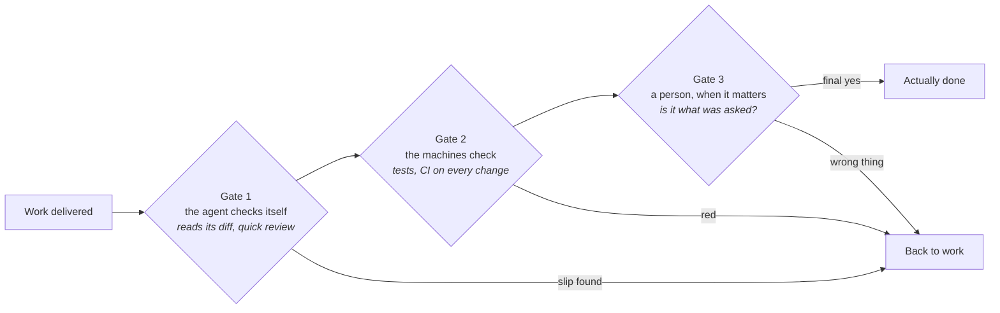

# Verifying agent work

When a contractor says the kitchen is finished, you still turn the taps before you pay. An
agent's "done" deserves the same walk-through - agents report success whether or not the
work is right, and checking is what catches the difference before the wrong version ships.

**In this module:**

- Why an agent's "done" is a claim, not a fact
- The three gates between "done" and done: the agent, the machines, a person
- How to aim checking where it matters - without blowing time and tokens on heavy reviews
  of everything

## "Done" is a claim, not a fact

**An agent says "done" with the same confidence whether the work is right or wrong.**

- It is most confidently wrong exactly where nobody looked: error handling, edge cases, the
  path you didn't test.
- Your own impression of the work is unreliable too - this one has been measured.
- So: accept proof, not promises. "The tests pass" means something. "I have implemented
  this successfully" means nothing.

In plain terms: ask the agent to *show* you it working. If all you get back is another
sentence, nothing was checked.

## Three gates between "done" and done

So you check. But checking isn't one act - work passes three gates, and each catches what
the one before can't.

**Gate 1 - the agent reviews its own work.** A quick self-review before handing over.
Cheap, runs on everything, and catches real slips: a typo, a missed rename, a forgotten
file. But know its limit: an author re-reads work through the same assumptions that produced
the mistake - no author proofreads their own book well. So keep it light - in our
experience, a review of just the change (the diff) is plenty; `/code-review low` in our
setup - and never let it count as the review. Heavy reviews of everything just burn time
and tokens.

**Gate 2 - the machines check every change.** Tests, linters, a CI pipeline. A cook who
tastes while cooking catches mistakes early - and while it works, an agent loops the same
way: try, check, fix, try again. Every automated check you give it is a wall it can't talk
its way past. Machines hold walls best: run the tests on every change, and nothing merges
red. A check that runs by itself never gets skipped.

**Gate 3 - a person, when it matters.** The first two gates only answer *does it work*.
The question only this gate can answer: **is it what was asked?** You asked for a CSV
export for the accountant; you got a flawless, fully tested JSON export - gates one and two
passed, and it's still the wrong thing. For bigger work, fresh eyes help before you: a new
session or another reviewer that sees only the change, not the conversation behind it
(`review-suite`, `/code-review` in a fresh session). But the final yes is yours - checked
against the task, not against what got built. Which is why "what was asked" must be written
down before building: agree what done looks like while planning (`grill-me`, `to-spec`),
or gate 3 has nothing to check against. This gate also catches quiet goal-shrinking - an
agent delivering a smaller thing and describing it as the thing.

`verify-feature` feeds the gates evidence: the agent drives the real app and brings back
screenshots and data - proof it works, and the material you judge "is it what was asked"
with.

|  | Gate 1: the agent | Gate 2: the machines | Gate 3: a person |
|---|---|---|---|
| Checks | its own diff | every change, automatically | the result against the task |
| Catches | slips | anything a test can express | the wrong thing done well |
| Costs | seconds | nothing after setup | your attention - spend it rarely |

## Aim it - and don't overspend

Even three gates can't check everything, and trying blows time and tokens. Where you check
is a decision - make it on purpose, like a building inspector: they don't check every
brick, they check the foundations, the wiring, the load-bearing walls - where failure is
expensive.

- Left alone, an agent checks where checking is easy: the happy path. Bugs live where
  checking is awkward: where two systems meet, strange inputs, the thing that only fails
  the second time.
- So before building, ask: "where would this realistically break?" Write the answers into
  the task - now checking happens where *you* worry, not where it's convenient.
- Match the spend to the stakes. A small fix: gate 1 and 2 are enough. A bigger or riskier
  feature: full gate 3 with fresh eyes and `verify-feature` evidence. Throwaway work you'll
  delete tonight: skip checking entirely.

## What you can do

- **Ask for proof, not promises.** Finish every task with something that could have failed:
  tests run, the app clicked through, the number checked in the database.
- **Agree what "done" looks like before building.** Which checks must pass, what a user
  must be able to do afterwards, where it would realistically break - into the task
  (`grill-me`, `to-spec`; `tdd` turns the risky spots into checks written first).
- **Keep gate 1 light.** In our experience a self-review of just the diff is plenty
  (`/code-review low`) - save the heavy reviews for where they're needed.
- **Let machines hold gate 2.** Tests in a CI pipeline, run on every change - nothing
  merges red, nobody has to remember.
- **Give bigger work fresh eyes at gate 3.** A review that didn't write the code
  (`review-suite`, `/code-review` in a new session) - then your final yes, checked against
  the task.
- **Broken? Make it fail on demand first.** "It's broken, fix it" sends the agent guessing.
  Get a way to trigger the problem every time, fix until the trigger comes back clean, keep
  the check afterwards (`diagnosing-bugs`).

## What to remember

- Accept proof, never promises. If nothing could have failed, nothing was checked.
- Three gates: the agent, the machines, a person - each catches what the one before can't.
- Only a person can answer "is it what was asked" - so write down what done means before
  building.
- Check where things would realistically break - and only as much as the stakes deserve.
- An author can't judge its own work. Judgment takes fresh eyes.
