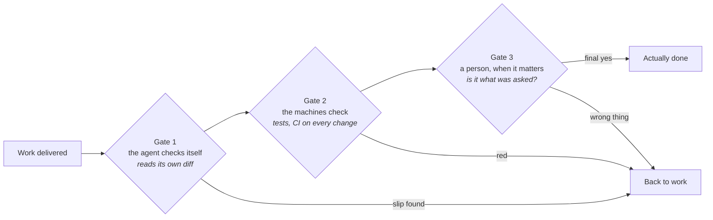

# Verifying agent work

When a contractor says the kitchen is finished, you still turn the taps before you pay. An
agent's "done" needs the same walk-through. An agent reports success whether or not the work
is right. Your check catches the difference before the wrong version ships.

**In this module:**

- Why an agent's "done" needs proof
- The three gates between "done" and done: the agent, the machines, a person
- How to aim your checks, and how much to spend

## An agent's "done" needs proof

**An agent says "done" with the same confidence whether the work is right or wrong.**

- It is most confidently wrong where nobody looked: error handling and edge cases.
- Your own impression of the work is unreliable too. This has been measured.
- So ask for proof. A test run that passes is proof. "I have implemented this successfully"
  is a report.

In plain terms: ask the agent to *show* you the work running.

## Three gates between "done" and done

**Work passes three gates, and each one catches what the gate before it cannot.**

**Gate 1 - the agent reviews its own work.** The agent reads its own change before handing
the work over. It is cheap and can run on everything. It catches real slips: a typo, a
missed rename. It has one limit. The author re-reads the work with the same assumptions that
produced the mistake. So keep gate 1 light, and do not let it replace the other two gates. In
our experience a review of the change alone (the diff) is enough - `/code-review low` in our
setup. A heavy review of everything burns time and tokens.

**Gate 2 - the machines check every change.** Tests, linters and a CI pipeline. A cook tastes
the food while cooking and catches mistakes early. An agent works the same way: try, check,
fix, try again. Each automated check is a wall the agent cannot talk its way past. Run the
tests on every change, and nothing merges red.

**Gate 3 - a person, when it matters.** The first two gates answer one question: does it
work? Gate 3 answers another: **is it what was asked?** You asked for a CSV export for the
accountant. You got a fully tested JSON export. Gates one and two passed, and the work is
still wrong. For bigger work, get fresh eyes first: a new session or another reviewer that
sees the change without the conversation behind it ([`review-suite`](../skills/review-suite/SKILL.md), `/code-review` in a fresh
session). The final yes is yours, checked against the task. So agree what done looks like
while you plan ([`grill-me`](../skills/grill-me/SKILL.md), [`to-spec`](../skills/to-spec/SKILL.md)), or gate 3 has nothing to check against. This gate
also catches goal-shrinking, where an agent delivers a smaller thing and calls it the whole
thing.

[`verify-feature`](../skills/verify-feature/SKILL.md) produces the proof for gate 3. The agent drives the real app and brings back
screenshots and data.

|  | Gate 1: the agent | Gate 2: the machines | Gate 3: a person |
|---|---|---|---|
| Checks | its own diff | every change, automatically | the result against the task |
| Catches | slips | anything a test can express | the wrong thing done well |
| Costs | seconds | nothing after setup | your attention - spend it rarely |

## Aim your checks, and do not overspend

**Three gates cannot check everything, so choose where you check.**

A building inspector does not check every brick. They check the foundations and the
load-bearing walls, where failure is expensive.

- Left alone, an agent checks where checking is easy: the happy path. Bugs live where
  checking is awkward: where two systems meet, strange inputs, the thing that fails only the
  second time.
- So ask before building: "where would this realistically break?" Write the answers into the
  task, so the checks land where *you* worry.
- Match the spend to the stakes. A small fix needs gates 1 and 2. A bigger or riskier feature
  needs gate 3, with fresh eyes and `verify-feature` proof. Throwaway work you delete tonight
  needs none.

## What you can do

- **Ask the agent for proof.** End every task with something that could have failed: tests
  run, the app clicked through, a number checked in the database.
- **Agree what "done" means before building.** Which checks must pass, what a user must be
  able to do afterwards, where the work would break - written into the task (`grill-me`,
  `to-spec`; [`tdd`](../skills/tdd/SKILL.md) turns the risky spots into checks written first).
- **Keep gate 1 light.** In our experience a self-review of the diff is enough
  (`/code-review low`).
- **Let machines hold gate 2.** Tests in a CI pipeline, run on every change. Nothing merges
  red, and no one has to remember.
- **Give bigger work fresh eyes at gate 3.** A review by someone who did not write the code
  (`review-suite`, `/code-review` in a new session).
- **Make a bug fail on demand first.** "It's broken, fix it" sends the agent guessing. Get a
  way to trigger the problem every time. Fix until the trigger comes back clean, then keep the
  check ([`diagnosing-bugs`](../skills/diagnosing-bugs/SKILL.md)).

## What to remember

- Ask for proof at the end of every task - something that could have failed.
- Three gates check the work: the agent, the machines, a person. Each catches what the gate
  before it cannot.
- Only a person answers "is it what was asked". Write down what done means before building.
- Check where the work would break, and only as much as the stakes deserve.
- An author is a poor judge of their own work.
