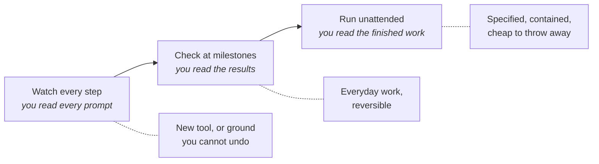

# Working unattended

Nobody stands over a dishwasher while it runs. You load it, close the door, and check the
plates at the end - and the closed door is what makes not-watching safe. Industrial safety has
worked this way for a century: you don't protect people by asking them to concentrate harder,
you build machines that cannot reach them. Working unattended is the same problem, with the
same answer.

**In this module:**

- Why approving every step protects less than it appears to
- Containment: making not-watching safe, instead of watching harder
- How far a given piece of work can run alone
- Where the human checkpoint actually belongs

## Approving every step stops being a check

**Permission prompts stop being read long before they stop appearing.**

- The safest-looking setup is an agent that asks before every action. It holds for about an
  hour. Then the prompts blur, "yes" becomes a reflex, and the feeling of control outlives the
  control itself.
- This is a known failure mode in every safety-critical field - it's why hospital staff tune
  out monitor alarms. Attention is a consumable, and a prompt firing forty times a day spends
  all of it.
- The reflex gets trained on the harmless cases - read a file, edit a file - and then fires on
  the one that isn't.

In plain terms: if you aren't reading the prompts, you aren't reviewing anything. You're
clicking.

Traditional development settled this decades ago. Nightly builds and deployment pipelines ran
unattended and nobody sat watching them - they were trusted for where they ran and what they
were allowed to touch, not for anyone confirming each step.

## Containment beats supervision

**Safety comes from what the agent can reach, not from how closely you watch it.**

Two boundaries do most of the work, and both predate agents by decades:

- **What it can touch.** Its own copy of the code, on its own branch, in its own folder - not
  the shared main line, and not anyone else's work in progress.
- **What it can reach.** No keys to live systems, no real customer data, network access
  limited to what the job needs.

Draw those once and most of the prompts stop being necessary - not ignored, unnecessary.
Sandboxing an agent this way has been measured to cut permission prompts by around 84% while
*raising* safety rather than relaxing it. That number is the whole argument: the prompts were
never the protection. The boundary was.

This is least-privilege access wearing new clothes - the same reason you don't hand every
developer production credentials and ask them to be careful.

The phrase worth keeping is **blast radius**: not "will this go wrong" but "how far does it
spread if it does".

| If this goes wrong | Blast radius | Safe to run alone? |
|---|---|---|
| Renaming things on a branch | A diff you throw away | Yes |
| Adding tests to existing code | Some wasted minutes | Yes |
| Changing how prices are calculated | Wrong numbers reaching customers | Not without a person |
| Anything holding live keys or customer data | Cannot be taken back | No |

The test is undo. A branch can be deleted. A leaked password cannot.

## How far to let it run

**Unattended isn't a switch. It's a ladder, and different work sits on different rungs.**

- **Watch every step.** Your first week with a new tool, or genuinely dangerous ground.
  Watching *while you still read* is how you learn what the agent does - the value is the
  learning, not the protection.
- **Check at milestones.** The everyday setting. The agent stops where the job divides: a plan
  agreed, a first slice working, the tests green. You judge results, not keystrokes.
- **Run unattended.** Well-specified work with a small blast radius, inside its own contained
  space. You read the finished work and nothing before it.

Climbing a rung isn't about trusting the agent more - it's the same agent all day. It's about
the work being clearly specified, cheaply undone, and checkable at the end.

## Freedom belongs to the task

**"How much should we trust the agent?" has no answer. "What happens if this task goes wrong?"
has one.**

- Decide it when you write the ticket, while the task is in front of you. Judging "can this
  run alone?" mid-afternoon is how risky work slips through on autopilot.
- Two labels carry it in our flow: `afk` for work meant to run unattended start to finish, and
  `hitl` for work where a human stays in the loop. **`hitl` is the default.** Unattended is
  granted, never assumed.
- The question that picks the label: if the agent got this wrong and you only saw it at
  review - annoying, or dangerous? Annoying can run alone.
- Freedom ends at the commit either way. The agent writes, tests and commits; a person merges.
  That door stays human, because merging is where the work becomes everyone's.

## What you can do

- **Give the agent its own room first.** Always its own branch, its own folder when several
  sessions run at once, and no live access while it works alone.
- **Put hard walls on the few actions that must never happen.** Written once, and they never
  get tired the way you do.
- **Then stop approving inside the walls.** Once the boundary holds, step-by-step approval
  buys nothing except the reflex.
- **Move your attention to the exit.** The diff, the review, the merge - one honest look beats
  a day of reflex clicks (`verify-feature` for evidence, `review-suite` for a sweep).
- **Label the work as you create it.** `afk` or `hitl`; `implement` stops at the commit either
  way, so the merge stays yours.
- **Start unattended on work you'd happily throw away.** A first `afk` run on something
  disposable shows you where your boundaries leak.

## What to remember

- Prompts you no longer read are not a safety system - they are a habit that looks like one.
- Containment beats supervision: decide once what the agent can reach, not forty times a day.
- Ask about blast radius, not likelihood. The real test is whether it can be undone.
- Autonomy belongs to the task, not the agent - set it when you write the ticket, and let
  human-in-the-loop be the default.
- Unattended still ends at a person: the agent commits, a human merges.
