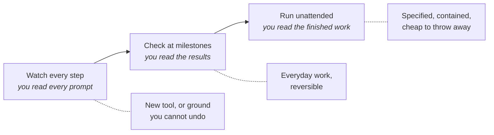

# Working unattended

Nobody stands over a dishwasher while it runs. You load it, close the door, and check the plates
at the end. The closed door makes not-watching safe. Industrial safety has worked the same way
for a century. It builds machines that cannot reach people.

**In this module:**

- Why approving every step protects less than it looks
- How containment makes not-watching safe
- How far a piece of work can run alone
- Where the human checkpoint belongs

## Approving every step stops being a check

**Permission prompts stop being read long before they stop appearing.**

- The safest-looking setup asks before every action, and it holds for about an hour. After
  that the prompts blur and "yes" becomes a reflex.
- This is a known failure mode in safety-critical fields, which is why hospital staff tune out
  monitor alarms. A prompt that fires forty times a day uses up all your attention.
- The reflex gets trained on the harmless cases, such as reading a file, and then fires on the
  case that matters.

In plain terms: if you do not read the prompts, you are not reviewing the work.

Traditional development settled this decades ago. Nightly builds and deployment pipelines ran
unattended, and no one watched them. They were trusted for where they ran and what they could
touch.

## Containment beats supervision

**What the agent can reach decides how safe it is.**

Two boundaries do most of the work, and both are older than agents:

- **What it can touch.** Its own copy of the code, on its own branch, in its own folder, away
  from the shared main line and anyone else's work in progress.
- **What it can reach.** No keys to live systems, no real customer data, and network access
  limited to what the job needs.

Draw those two boundaries once and most of the prompts become unnecessary. Sandboxing an agent
this way has been measured to cut permission prompts by around 84% while raising safety.

This is least-privilege access under a new name, the same reason you do not hand developers
production credentials.

The phrase worth keeping is **blast radius**, meaning how far the damage spreads.

| If this goes wrong | Blast radius | Safe to run unattended? |
|---|---|---|
| Renaming things on a branch | A diff you throw away | Yes |
| Adding tests to existing code | Some wasted minutes | Yes |
| Changing how prices are calculated | Wrong numbers reaching customers | Not without a person |
| Anything holding live keys or customer data | Cannot be taken back | No |

The test is whether you can undo it. You can delete a branch, but you cannot recall a leaked
password.

## How far to let it run

**Unattended work sits on a ladder, and different jobs sit on different rungs.**

- **Watch every step.** Use this in your first week with a new tool, or on dangerous ground.
  Watching while you read the prompts teaches you what the agent does.
- **Check at milestones.** This is the everyday setting. The agent stops where the job divides:
  a plan agreed, a first slice working, the tests green. You judge the results.
- **Run unattended.** Use this for well-specified work with a small blast radius, inside its
  own contained space. You read the finished work only.

You climb a rung when the work is specified clearly, cheap to undo, and checkable at the end.
It is the same agent all day.

## Freedom belongs to the task

**Ask what happens if this task goes wrong; the answer tells you how much freedom it gets.**

- Decide it when you write the ticket, while the task is in front of you. Judging "can this run
  alone?" mid-afternoon lets risky work slip through on autopilot.
- Two labels carry the decision in our flow. `afk` marks work meant to run unattended start to
  finish, and `hitl` marks work where a human stays in the loop. **`hitl` is the default**, so
  unattended is something you grant.
- One question picks the label: if the agent got this wrong and you only saw it at review,
  would that be annoying or dangerous? Work that is only annoying can run alone.
- Freedom ends at the commit unless you granted the merge. The agent writes, tests and commits;
  on `hitl` work a person merges, and an `afk` label is what says the agent may.

## What you can do

- **Give the agent its own space first.** Its own branch, its own folder when sessions run in
  parallel, and no live access while it works alone.
- **Block the few actions that must never happen.** You write the rules once and they hold
  while you are away.
- **Then stop approving inside the boundary.** Once it holds, step-by-step approval only
  trains the reflex.
- **Move your attention to the exit.** Read the diff before you merge ([`verify-feature`](../skills/verify-feature/SKILL.md) for
  evidence, [`review-suite`](../skills/review-suite/SKILL.md) for a sweep).
- **Label the work as you create it.** `hitl` work stops at the commit and the merge stays
  yours; `afk` is the permission to merge on green. The label is the decision, so make it when
  you write the ticket rather than when the branch is waiting.
- **Start unattended on work you would happily throw away.** A first `afk` run on something
  disposable shows where your boundaries leak.

## What to remember

- Prompts you no longer read are not a safety system; they are a habit that looks like one.
- Containment beats supervision, so decide once what the agent can reach instead of forty
  times a day.
- Ask how far the damage spreads and whether you can undo it.
- Autonomy belongs to the task. Set it when you write the ticket, and let human-in-the-loop be
  the default.
- Unattended work still ends at a decision a person made. On `hitl` that decision is the merge
  itself; on `afk` it was the label, granted before the work started.
