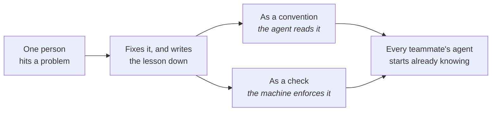

# Working as a team

Walk into a well-run workshop: the jigs are on the wall, the shelves are labelled, and the
house way of working is built into the bench rather than carried in people's heads. Someone
new is useful on day one because the shop is set up, not because a colleague stood over them
explaining. A team working with agents needs the same, with one twist - the setup has to be
readable by the agents too, and every one of them arrives new every morning.

**In this module:**

- What the team shares, and what stays on your own machine
- How one person's lesson becomes the whole team's
- Why checking became the tightest constraint
- What we honestly don't know yet

## What the team shares, and what stays yours

**Team conventions belong in the repo, where every agent reads them.**

Your editor and your shortcuts are nobody else's business. How this project is built, what
"done" means here, which corners are booby-trapped - that half was always shared, and it lived
in a style guide, a linter config and one senior's memory. Agents change only where it has to
sit: somewhere they will actually look.

| Where | What belongs there | Who it serves |
|---|---|---|
| Your machine | editor, keybindings, shortcuts, unproven experiments | you |
| The repo | conventions, what done means, known traps, the checks that run on every change | every teammate's agent, automatically |
| Shared skills | procedures the team repeats - picking work up, reviewing, releasing | every project the team touches |

A chat session is one person and one agent, and it evaporates when it ends - so the work needs
a shared home too. One issue per piece of work, decisions written into it as they're made, and
anyone can pick it up cold without a briefing (`to-issues`).

In plain terms: if you'd have to explain it to a new colleague, write it where the agent reads.

## One person's lesson becomes the team's

**A lesson written down once is a lesson every agent on the team already has.**

The old version was tribal knowledge: one person knew the deploy breaks if you skip a step,
and everyone else learned by falling in. Writing it down was always the right answer and
always what nobody got round to. What changed is the payoff - it now gets read on every task,
by everyone's agent.

- **Written conventions bend; mechanical ones hold.** A sentence in the instruction file is
  advice an agent can talk itself past. A check that runs on every change is a wall it can't.
- **More is not better.** A bloated instruction file pulls attention toward files that don't
  matter. If the agents get worse, go read what you wrote.

Nobody has measured whether this improves team outcomes; the alternative is five people
improvising five setups that die with the session. The tracker and the commit history already carry most of
what a session learned; `handoff` catches the decisions that were only ever said out loud.

## Writing code got cheap. Checking it didn't

**Agents made producing code fast and did nothing for the cost of reading it.**

This has been measured, and the direction holds across datasets that disagree about almost
everything else: changes get bigger, review time climbs steeply, and a real share of work
merges with no review at all. The same data shows teams finishing more overall - both are true
at once. The bottleneck moved: your scarce resource is judgment, not typing speed - so plan
review time the way you plan build time. Twice the code needs twice the checking, or the
checking quietly stops happening.

- Small changes over big ones. Ten small ones get read; one two-thousand-line one gets skimmed
  and waved through. More agents at once sends more of it at the same one person.
- Let an agent take a first pass (`review-suite`) so the mechanical problems are gone before a
  person reads. But agent review with nobody behind it has been measured doing worse than
  people alone: a first pass, never the review.

**Whoever hands it in, owns it.** Send a change for review without reading it yourself and you
haven't delegated to an agent - you've delegated to your colleagues, who could have prompted
one themselves. In our flow `implement` stops at the commit and hands the branch to a person.

## The signals that used to prove understanding

**Clean work delivered fast no longer proves anyone understood it.**

Teams have always read signals: tidy code, quick turnaround, handling something hard without
help. Those were difficult to fake, because producing them required understanding. An agent
produces all three in seconds - so the signals stopped meaning what they meant, while our
instincts still trust them. A reviewer spends forty-five minutes on a careful review, then
finds the author can't explain their own change.

The rule that travels best is a self-check before it's a review criterion: **don't hand in
code above your own comprehension level.** Around it, ask people to explain - "walk me through
why it works this way" tells you more than reading the diff.

Be straight about the limit here. Whether this builds juniors or hollows them out has not been
studied: no cohort tracked over time, no before and after. What we can say is narrower -
merging code nobody can explain is how a team stops having juniors who learn.

## What you can do

- **Write the shared half down where the agent reads it.** If a teammate's agent would get it
  wrong without it, it isn't personal setup.
- **Back the rules that matter with a machine.** A check that runs on every change never gets
  skipped and never needs remembering; a sentence does.
- **Put the work in issues, and the decisions where the next person will look** (`to-issues`,
  `handoff`), so
  the next person starts with what you learned instead of asking around.
- **Read your own change before you ask anyone else to**, and say where it's heavily
  AI-written so the reviewer knows to look harder.
- **Make explanation part of done** for anyone still learning the system.

## What to remember

- Personal setup stays yours; anything a teammate's agent would need goes in the repo.
- Written conventions bend and mechanical ones hold - back the important rules with a check.
- One lesson written down is a lesson every agent on the team already has.
- Producing got cheap and checking didn't. Judgment is the constrained resource now.
- Whoever hands the work in owns it - and fast, clean output no longer proves understanding.
