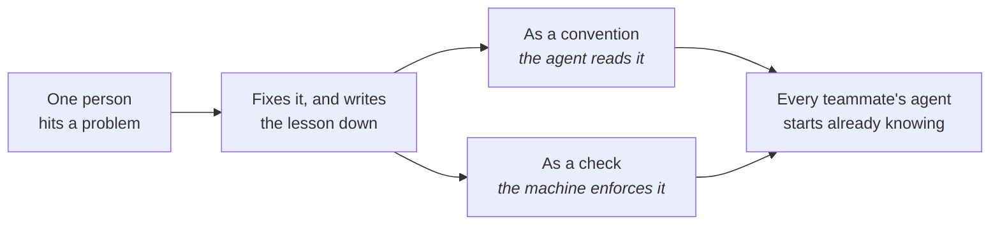

# Working as a team

Walk into a well-run workshop. The jigs hang on the wall, the shelves carry labels, and the house
way of working is built into the bench. Someone new is useful on their first day because the shop
is already set up. A team working with agents needs the same thing, with one difference: the setup
has to be readable by the agents, and every agent arrives new each morning.

**In this module:**

- What the team shares, and what stays on your own machine
- Why one shared way of working beats several private ones
- How one person's lesson becomes the whole team's
- Why checking became the tightest constraint
- What we honestly do not know yet

## What the team shares, and what stays yours

**Team conventions belong in the repo, where every agent reads them.**

Your editor and your shortcuts are your own business. How this project gets built, what "done"
means here, which corners are booby-trapped: that half was shared even before agents. It lived in a
style guide, a linter config, and one senior engineer's memory. What agents change is where it has
to sit. It now has to sit somewhere they will look.

| Where | What belongs there | Who it serves |
|---|---|---|
| Your machine | editor, keybindings, shortcuts, unproven experiments | you |
| The repo | conventions, what done means, known traps, the checks that run on every change | every teammate's agent, automatically |
| Shared skills | procedures the team repeats, such as picking work up, reviewing and releasing | every project the team touches |

A chat session holds one person and one agent, and it ends when they stop. So the work needs a
shared home as well. Use one issue per piece of work, write decisions into it as you make them, and
anyone can pick it up cold (`to-issues`).

In plain terms: if you would have to explain it to a new colleague, write it where the agent reads.

## One shared way of working, instead of several private ones

**Left alone, each person invents a different process, and the differences cost the team.**

Give six developers the same agent and no shared setup, and you get six methods. One opens a pull
request for every change. Another commits straight to main. One asks the agent for tests, one skips
them. Each method works for the person who chose it, and together they leave a codebase that reads
as though six teams built it.

That costs the team twice. A reviewer has to work out which method produced a change before judging
it, and a new colleague has no house way to be taught. One shared setup removes the guessing: the
same skills, checks and definition of done for everyone, so a new person inherits the process
rather than a colleague's habits.

In plain terms: one way that everyone follows beats six good ones that nobody shares.

## One person's lesson becomes the team's

**A lesson written down once is a lesson every agent on the team already has.**

The old version was tribal knowledge. One person knew the deploy breaks if you skip a step, and
the rest learned by falling in. Writing it down was the right answer, and the thing nobody got
round to. What changed is the payoff: a written lesson now gets read on every task, by every
person's agent.

- **Written conventions bend; mechanical ones hold.** A sentence in the instruction file is advice
  an agent can talk itself past. A check that runs on every change is a wall it cannot.
- **Keep it short.** A bloated instruction file pulls attention toward files that do not matter. If
  the agents get worse, go and read what you wrote.

We have not measured whether this improves team outcomes. The alternative is five people
improvising five setups that end with the session. The tracker and the commit history already carry
most of what a session learned, and `handoff` catches the decisions that were only said out loud.

## Checking is now the constraint

**Agents made producing code fast and left the cost of reading it where it was.**

This has been measured, and the direction holds across datasets that disagree about almost
everything else. Changes get bigger. Review time climbs steeply. A real share of work merges with
no review at all. The same data shows teams finishing more overall, and both results are true at
once. So judgment is the constrained resource, and review time needs planning the way build time
does. Twice the code needs twice the checking.

- Prefer small changes. Ten small ones get read; one two-thousand-line change gets skimmed and
  waved through. Running more agents at once sends more work to the same reviewer.
- Let an agent take a first pass (`review-suite`), so the mechanical problems are gone before a
  person reads. Agent review with nobody behind it has been measured doing worse than people alone,
  so keep the person.

**Whoever hands it in owns it.** Send a change for review without reading it yourself, and you have
delegated to your colleagues rather than to an agent. They could have prompted one themselves. In
our flow `implement` stops at the commit and hands the branch to a person, unless the ticket
carries an `afk` label saying it may merge on green.

## The signals that used to prove understanding

**Clean work delivered fast no longer proves that anyone understood it.**

Teams read signals: tidy code, quick turnaround, a hard problem handled without help. Those were
difficult to fake, because producing them required understanding. An agent produces all three in
seconds, so the signals stopped meaning what they meant while our instincts kept trusting them.

The rule that travels best is a self-check: **do not hand in code above your own comprehension
level.** Around it, ask people to explain. "Walk me through why it works this way" tells you more
than reading the diff.

Be straight about the limit here. Whether this builds juniors or hollows them out has not been
studied: no cohort tracked over time, no before and after. What we can say is narrower. Merging
code nobody can explain is how a team stops having juniors who learn.

## What you can do

- **Write the shared half where the agent reads it.** If a teammate's agent would get it wrong
  without it, it belongs in the repo.
- **Agree one way of working, then make it the default.** Pick the process once, put it in the
  repo, and let new people inherit it.
- **Back the rules that matter with a machine.** A check runs whether anyone remembers it. A
  sentence in a file does not.
- **Put the work in issues, and the decisions where the next person will look** (`to-issues`,
  `handoff`).
- **Read your own change before you ask anyone else to**, and say where it is heavily AI-written so
  the reviewer looks harder. Make explanation part of done for anyone still learning the system.

## What to remember

- Personal setup stays yours. Anything a teammate's agent would need goes in the repo.
- One way of working that everyone follows beats six good ones that nobody shares.
- Written conventions bend and mechanical ones hold, so back the important rules with a check.
- One lesson written down is a lesson every agent on the team already has.
- Producing got cheap and checking did not, so judgment is the constrained resource now.
- Whoever hands the work in owns it, and fast clean output no longer proves understanding.
