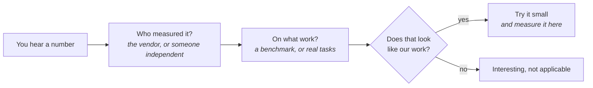

# Measuring what actually changed

Businesses don't run on how the quarter felt - they close the books. The ledger flatters
nobody, which is why it settles arguments that opinion never could. Working with agents is
where that discipline is thinnest: the numbers people repeat came from somewhere else, and the
sense that everything got faster came from nowhere at all.

**In this module:**

- Why feeling faster isn't evidence of being faster
- How to check a number before you repeat it
- How to measure your own way of working, cheaply

## Feeling faster and being faster are different things

**Your impression of speed is a real signal - just not about speed.**

This has been measured, and the result is uncomfortable: people working with agents felt
meaningfully faster on their own tasks, while the same work, timed, came out slower. Both were
true at once.

None of this is new. Teams have always felt on track the week before the deadline slipped, and
story points have always climbed while nothing reached customers sooner. Agents widened the gap
between felt and actual rather than creating it: the waiting now arrives in pieces small enough
to miss.

| What the feeling reports | What it can't tell you |
|---|---|
| The work was easier to start | Whether it finished sooner |
| The tedious stretches got shorter | Whether the total time moved |
| More got touched | Whether it stayed shipped |

In plain terms: "the team feels faster" is worth knowing - it's a morale reading. It just can't
be spent as a speed reading.

## Every number arrives without its study

**A number quoted without saying what was measured is marketing that sounds scientific.**

Numbers travel; their conditions stay behind. One tool advertised a large saving; when an
outside team measured it on real coding tasks, the saving was a small fraction of the headline,
because the advertised figure came from work that looked nothing like coding. Not a lie - just
not about you.

So run anything you're about to repeat through a short check.

If nobody can answer the first two boxes, you're holding an advertisement. Thresholds get the
same treatment: most numbers in circulation - ours included - are habits that worked for
someone once, and stay folklore until somebody measures them here.

## Twenty real tasks settle an argument

**The cheapest way out of a debate about agents is to measure instead of arguing.**

"It's great for tests." "It's useless on our codebase." "Juniors shouldn't touch it." These run
forever, because everyone has anecdotes and nobody has evidence - and the evidence costs less
than the argument. Take twenty tasks off your own backlog, not someone else's benchmark, since
the whole problem is that your work doesn't look like the studies. Run them the way you
actually work, and write down four things.

| Task | Time | Shipped? | Fixed afterwards |
|---|---|---|---|
| One line on what it was | Roughly - nearest half hour is fine | Went out, or quietly abandoned | What came back and had to be redone |

Twenty is small enough to finish and big enough to show a pattern. Compare like with like -
same kind of task, with and without an agent - and change one thing at a time. The last column
is the honest one: speed that creates rework isn't speed. In our experience the tally is the
easy part; remembering to fill that column in is what slips.

## What you can do

- **Ask two questions before repeating a number.** Who measured it, and on what work. No answer
  means marketing, however good it sounds.
- **Keep a tally for two weeks.** Twenty real tasks, four columns, one spreadsheet - no tooling,
  no dashboard, no metrics meeting.
- **Count rework next to delivery.** Write down what came back, not only what went out.
- **Give a new habit a few weeks before judging it.** Everything is slow while it's unfamiliar;
  measuring during the awkward phase measures the awkwardness.
- **Let your own numbers expire.** A threshold that matched last quarter's tools is folklore
  this quarter - re-check it, or drop it.

## What to remember

- Feeling faster and being faster are different measurements - and where they've been compared,
  they disagreed.
- A number without its conditions is marketing: ask who measured it, and on what work.
- Twenty real tasks from your own backlog beat any argument about whether agents help here.
- Count the rework beside the speed, or you've measured only the flattering half.
