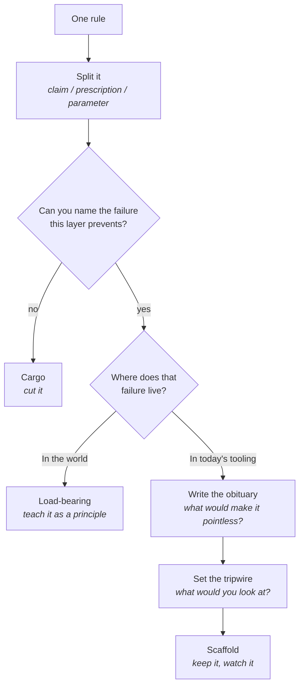

# When rules expire

Walk into an old workshop and you'll find safety rules for machines sold years ago. Nobody
takes them down, and people follow them long after the reason is gone. AI rules age the same
way, only faster: most exist because a model couldn't be trusted, and models change.

**In this module:**

- Why most AI rules are bets on a passing weakness
- The three layers in a rule, and which expires first
- Four questions that sort a rule into keep, update, watch or cut
- Where the test goes wrong, and what it must never touch

## Every rule is a bet against a weakness

**A rule exists because someone decided something couldn't be trusted yet.**

- "Check the agent's work" bets that it will claim success it hasn't earned.
- Few teams write the *because* down. The reason stays in one head, and a year later the team
  can't tell discipline from habit.
- Prompt wording is the clearest example. The advice used to be a list of phrasings you had
  to say: magic openers, flattery, threats. Better models made that pointless.

In plain terms: the claim survived and the *specific wording* died.

Traditional development knows the shape: coding standards outlive the compiler bug they were
written for.

## Rules expire a layer at a time

**A rule is rarely one thing. Three layers sit inside it, and they age at different speeds.**

| Layer | What it is | Lifespan | In the wording example |
|---|---|---|---|
| **Claim** | What's true about the world behind the rule | Longest | Stating the task clearly changes the result |
| **Prescription** | What to do about it | Medium | Use the known magic phrasings |
| **Parameter** | The number, tool, sequence or wording | Shortest | This list of phrases |

Two people fighting about a rule usually agree about the claim and disagree about the
parameter without noticing. Split the layers first, and the argument often turns out to be
about a number.

## Four questions that date a rule

Split the rule, then ask four questions of each layer.

- **Name the failure.** A specific bad outcome, ideally one you've watched happen. If nobody
  can name one, stop there.
- **Locate it.** In the world, or in this generation of tooling? A shared branch stays shared
  however good models get, while forgetting what it read an hour ago is tooling that ships
  changes.
- **Write the obituary.** One sentence naming what would make the rule pointless.
  "Eventually" and "models get better" don't count, because you can't go and look for either.
- **Set the tripwire.** A cheap check goes next to the rule. A check nobody runs leaves the
  rule unwatched and worth flagging, and no check at all means a review date.

Each layer gets one of four verdicts.

| Verdict | What it looks like | What to do |
|---|---|---|
| **Load-bearing** | The failure is in the world; no believable obituary exists | Teach it as a principle; no expiry date needed |
| **Dated parameter** | The claim holds; a number, tool or wording belongs to one era | Keep the claim, re-label the parameter |
| **Scaffold** | The failure is in the tooling; the obituary is plausible | Keep it, attach the tripwire, name who watches |
| **Cargo** | No nameable failure, or the failure is the author's habit | Cut it |

The most common honest result is a durable claim on an undefended parameter. Cheap scaffolds
with distant obituaries can wait; spend the effort on rules that fire on every task.

## Where the test goes wrong

**A method that can retire rules is more dangerous than the rules it grades.**

- **It becomes a licence to drop discipline you find annoying.** "Test-first is a workaround
  for bad models" arrives within a minute. The guard is the split: grade one layer at a time.
- **Everyone locates their own rules in the world and everyone else's in the tooling.** The
  obituary is the guard: reject any that fails to name something you could look for.
- **It rewards the articulate.** That's why naming the failure comes first, and why it has to
  be one you've seen. Mark hypothetical verdicts as provisional.
- **Some rules are out of scope.** Judge secrets, production data and anything sent outward
  by the worst case, because that damage is unbounded or irreversible. A better model doesn't
  shrink a worst case. Question how such a rule is implemented. Never question whether it
  should exist.

Not every line is a rule: a worked example only offers options, so ask whether someone would
be *wrong* to do otherwise. Run the test honestly and most rules survive.

## What you can do

- **Write the because next to the rule.** "No rewriting shared history, because an agent once
  erased a branch" can be retired sensibly one day.
- **Ask for the obituary out loud.** A vague one is obvious when you say it to someone, and
  anything with "eventually" in it goes back.
- **Name who watches each scaffold.** A rule kept because the tooling is weak needs a person
  and a cheap check attached, or it becomes permanent.
- **Grade your own rules first.** Ours turned up a threshold we'd been quoting as a
  measurement when it was a house policy, plus tools the models had outgrown.

## What to remember

- Most AI rules bet on a current weakness that can disappear while the rule stands.
- Rules expire a layer at a time: parameter first, prescription next, claim last if ever.
- Name the failure, locate it, write the obituary, set the tripwire. An obituary must name
  something you could go and look at.
- Rules against unbounded or irreversible damage are judged by the worst case, which a better
  model doesn't shrink.
