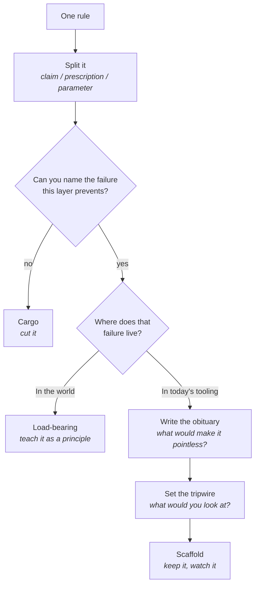

# When rules expire

Walk into an old workshop and you'll find safety rules posted for machines that were sold
years ago. Nobody takes them down, and nobody can say what they were for either, so they get
followed out of respect for whoever wrote them. Rules about working with AI age the same
way, only faster: most exist because a model couldn't be trusted with something, and models
change.

**In this module:**

- Why most AI rules are bets on a weakness that may not last
- The three layers inside a rule, and which one expires first
- Four questions that sort a rule into keep, update, watch, or cut
- Where the test goes wrong, and the rules it must never touch

## Every rule is a bet against a weakness

**A rule exists because someone decided something couldn't be trusted yet.**

- "Check the agent's work" bets that it will claim success it hasn't earned. "Start fresh
  before the window fills" bets that quality decays. Each was true of some model at some
  point.
- What almost nobody writes down is the *because*. The rule goes into the team wiki, the
  reason stays in one person's head, and a year later nobody can tell discipline from habit.
- Prompt wording is the clearest live example. The advice used to be phrasings you had to
  say to get decent results - magic openers, flattery, threats. Better models made nearly
  all of it pointless, and what replaced it is no new incantation: equip the model with what
  it needs, and say plainly what you're after.

In plain terms: the claim survived and the *specific wording* died.

Traditional development knows the shape - coding standards written for a compiler that got
fixed, a build step everyone still runs. Reasons die and rules don't, because the reasons
were never written next to them.

## Rules expire a layer at a time

**A rule is rarely one thing. It's three stacked, and they age at different speeds.**

| Layer | What it is | Lifespan | In the wording example |
|---|---|---|---|
| **Claim** | What's true about the world that makes the rule necessary | Longest | How clearly you state the task changes the result |
| **Prescription** | What to do about it | Medium | Use the phrasings known to unlock better answers |
| **Parameter** | The number, the tool, the exact sequence or wording | Shortest | This particular list of magic phrases |

The claim is still standing. The prescription was replaced. The parameter died first, as
parameters do.

This is the move that matters most in an argument. Two people fighting about a rule are
usually agreeing about the claim and disagreeing about the parameter, and neither has
noticed. Split it first, and the fight often turns out to be about a number.

## Four questions that date a rule

Split the rule, then ask four questions of each layer that's actually there.

- **Name the failure.** Not "it's best practice" - a specific bad outcome, ideally one
  you've watched happen. If nobody can name one, stop there.
- **Locate it.** In the world, or in this generation of tooling? A shared branch is shared
  however good models get, and a test that never failed has never shown it can fail;
  forgetting what it read an hour ago is tooling, and tooling ships changes.
- **Write the obituary.** One sentence naming what would make the rule pointless. If it
  contains "eventually" or "models get better", it isn't finished - that's a dodge wearing
  an answer's clothes.
- **Set the tripwire.** Would anyone notice if that happened? A cheap check goes next to the
  rule; a check nobody runs means the rule is unwatched, worth flagging on its own; no check
  at all, and you fall back to a review date.

Per layer, that produces one of four verdicts.

| Verdict | What it looks like | What to do |
|---|---|---|
| **Load-bearing** | The failure is in the world; a believable obituary is near-impossible to write | Teach it as a principle. No expiry date needed. |
| **Dated parameter** | The claim holds, but a number, tool or sequence belongs to one era | Keep the claim, strip or re-label the parameter. |
| **Scaffold** | The failure is in the tooling; the obituary is a plausible improvement | Keep it, attach the tripwire, name who watches. |
| **Cargo** | No nameable failure, or the failure is really the author's habit | Cut it. |

A durable claim on a parameter nobody can defend is the most common honest result, and that
pairing is the dated parameter. A verdict classifies, though - it doesn't decide. Cheap
scaffolds with distant obituaries can be kept for years; act on the expensive ones, the
rules that fire on every task.

## Where the test goes wrong

**A method that can retire rules is more dangerous than the rules it grades.**

- **It becomes a licence to drop discipline you find annoying.** "Test-first is just a
  workaround for bad models" arrives within a minute. The guard is the split: grade the
  smallest rule, never the bundle - watching a check fail is a fact about evidence, and the
  enforcement around it is not.
- **Everyone locates their own rules in the world and everyone else's in the tooling.** The
  obituary is the guard - reject any that doesn't name something you could go and look for.
- **It rewards articulacy, not correctness.** That is why naming the failure comes first,
  and why it has to be one you've seen. Mark hypothetical verdicts provisional.
- **Some rules are out of scope entirely.** Where the damage would be unbounded or
  irreversible - secrets, production data, anything that can be sent outward - judge by the
  worst case. Better models don't shrink a worst case, so question how such a rule is
  implemented, never whether it should exist.

Not every line is a rule, either: a menu or a worked example constrains nobody, so ask
whether someone would be *wrong* to do otherwise. And this is no deregulation exercise - run
it honestly and most rules survive, stronger for having an obituary and someone watching.

## What you can do

- **Write the because next to the rule.** "No rewriting shared history, because an agent
  once erased a branch" can be retired sensibly one day. The bare command is forever.
- **Split before you argue.** Name the claim, the prescription and the parameter, then find
  which layer people disagree on. Usually the parameter - a much smaller conversation.
- **Ask for the obituary out loud.** Reading it to another person is where the vague ones
  become audible. Anything with "eventually" in it goes back.
- **Name who watches each scaffold.** A rule kept because the tooling is weak needs a person
  and a cheap check attached, or it quietly becomes permanent.
- **Grade your own rules first.** Everyone's own look load-bearing and everyone else's look
  like cargo. Ours turned up a threshold we'd been quoting as a measurement when it was
  really a house policy - and we've cut tools whose guardrail the models had outgrown.

## What to remember

- Most AI rules are bets on a current weakness - the weakness can disappear while the rule
  stays standing.
- Rules don't expire whole - they expire a layer at a time: parameter first, prescription
  next, the claim last if ever.
- Name the failure, locate it, write the obituary, set the tripwire. No nameable failure, no
  rule worth keeping.
- "Models will get better" is not an obituary - name something you could go and look at.
- Rules against unbounded or irreversible damage are judged by the worst case, never by
  expected improvement.
