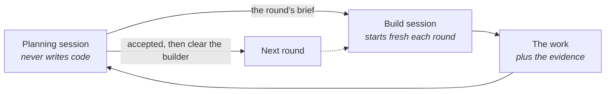
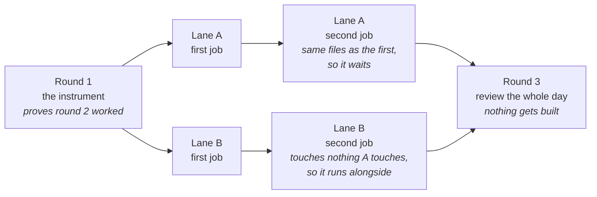

# Many agents on one job

A building site runs several trades at once, and the site manager never picks up a tool. They
decide what order the work goes in, who can be in which room, and whether last week's work is
good enough to build on top of. The plasterer cannot work in the room the electrician is still
wiring, so the order is not a preference - it comes from the work itself. Past a certain size,
the coordinating becomes the job.

**In this module:**

- When handing off once stops being enough
- Why the session that judges should not be the one that builds
- Why a report has to carry its evidence
- Where the order of the work comes from

## When one handoff stops being enough

**Handing off is a round trip. Big work needs something that keeps going.**

*Handing work off* is one brief out and one report back, which is the right shape for most work. It stops
fitting when a job has a dozen pieces, runs for hours, and the pieces have an order. Run that as
one long session and its memory fills before the job is done (*The context window*). Run it as twelve
separate handoffs and you are the one holding the plan, re-briefing every time. Neither fails
loudly; both just get worse as the day goes on.

The shape that fits is two jobs kept apart:

- **One session plans and judges.** It decides what goes out, reads what comes back, and rules
  on anything the builders get stuck on. It writes no code at all.
- **The other builds**, and gets cleared between rounds, so each round arrives as a brief it can
  read cold rather than a conversation it has to remember.
- **The planner's memory is the asset.** It stays clean because it never builds, which is what
  leaves room for judgment at the end of a long day.

**Say what and done, not how.** Name the goal, the boundaries and what finished looks like, then
let the work find its own route. A technical plan written before anyone has opened the files is a
guess, and handing an agent a detailed guess replaces an implementation it could have found with
one you imagined.

In plain terms: brief a contractor on the room you want, not on where each screw goes.

## Split the building from the judging

**The session that made the work is the worst one to ask whether it is good.**

*Verifying agent work* says an author is a poor judge of their own work. That holds for agents, and for the
same reason: the check runs against the same understanding that produced the mistake. A session
that has spent two hours getting something working has watched itself solve every problem, and
it reports accordingly.

- **Keep the maker and the judge in separate memories.** The judge should see the work without
  the conversation that produced it - which is what it gets if it never took part.
- **This is why the planner stays out of the code.** Not tidiness. If it builds, its judgment at
  the end is the builder's judgment wearing a different hat.
- **Judging can fan out too.** One agent per angle, each seeing only its own question
  (`review-suite` runs its passes this way).
- **Expect a judge to weigh badly at first.** Review passes find real things and then rate them
  wrongly, usually too high. Make each finding argue against itself before it earns a severity.

Traditional development settled this a long time ago: you do not approve your own pull request.

## Evidence, not verdicts

**A report you cannot check is a claim.**

*Handing work off* promises you the conclusion, and for one handoff that is fine. It stops being fine
here, because you are accepting work you did not watch several times a day, and each acceptance
becomes the ground the next round is built on. Prose drifts toward the stronger claim as it goes:
"mostly working" becomes "working" by the time it reaches a summary. Nothing is lying -
summarising rounds up, and it rounds up again at every hop.

So the rule that makes it safe: **every claim arrives with the raw output that proves it, pasted
in.** "The suite is green" is a verdict. Sixty lines of test output is evidence. A bare verdict
counts as not done, and goes back.

How much proof to ask for depends on what it would cost to be wrong - *Working unattended*'s blast radius,
applied to a report instead of an action.

| How much proof | What it looks like | Ask for it when |
|---|---|---|
| It ran | the actual output, pasted, not described | ordinary changes |
| It was broken on purpose | break the thing, show the check go red, fix it, show it go green | anything that adds a test or a guard |
| The real thing ran | the built artefact actually started and used, not only its tests | it has to work once deployed |

- **A check that has never failed is a claim too.** A test can pass while the thing it guards is
  broken, and it will keep passing forever. Breaking it once is the only way to find that out.
- **Working in the code is not working in the deployment.** Proved in tests and never wired up is
  a normal way to finish a day believing you shipped something.

In plain terms: ask for the inspection photo, not a note saying it passed.

## Where the order comes from

**Two jobs that touch the same file cannot run at the same time.**

The order is not priority and not preference. It falls out of what the work touches, and you can
work it out on paper before anything is dispatched: list the pieces, note the files each changes,
and let the overlaps draw the lines.

- **Same files means a queue. Different files means parallel.** Everything else is scheduling
  taste; this part is a fact about the work.
- **Anything that measures something else goes first.** Build the instrument, then build the
  thing it checks, or you will be judging round two with round two's own opinion of itself.
- **Keep a round for reviewing and build nothing in it.** Findings become tickets, not same-day
  fixes. Fixing what you just found, with the session that just found it, ends a tired day badly.
- **Check the tickets are still true before dispatching.** A ticket written a month ago describes
  a codebase that has moved. Verifying the premise is cheap; a builder faithfully implementing a
  stale one is not.
- **Fanning out costs.** One helper has been measured at around four times a plain chat, several
  at fifteen. Rounds multiply that again, so the job has to be worth the spend.

In our flow, `to-issues` writes tickets carrying their own blocking edges, so the order lives on
the tickets rather than in your head, and `pickup-issue` re-checks one against the live code
before anyone builds from it.

## What you can do

- **Keep the judging session out of the code.** One session that plans, dispatches and rules,
  and never edits a file. This is the whole trick, and it is free.
- **Ask for output, not verdicts.** Say it in the brief: paste what the command printed. Send
  back anything that arrives as a summary.
- **Break every new guard once on purpose.** Red, then green, both pasted. It takes a minute and
  it is the only proof the check works.
- **Draw the lanes from the files.** Note what each piece touches, queue the collisions, run the
  rest alongside (`to-issues` for the edges, `wayfinder` when the job is too big to hold).
- **Clear the builder between rounds.** A fresh session reading a written brief beats a tired one
  that was there for the last three (`handoff` to write it, `start` to pick it up).
- **Try it on two rounds before you try it on six.** The coordination is the part that is new,
  and it is cheaper to learn it small.

## What to remember

- One handoff is a round trip. Work with many pieces and an order needs a session that keeps
  going and a builder that starts fresh each round.
- The session that judges should never be the session that builds, because it would be checking
  its own understanding.
- Name what and done, not how. A detailed plan written before anyone opened the files is a guess.
- A report you cannot check is a claim. Evidence is pasted output; a bare verdict is not done.
- The order comes from what the work touches, not from what matters most.
